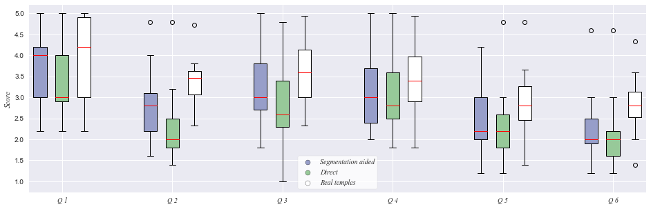
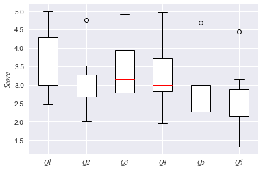
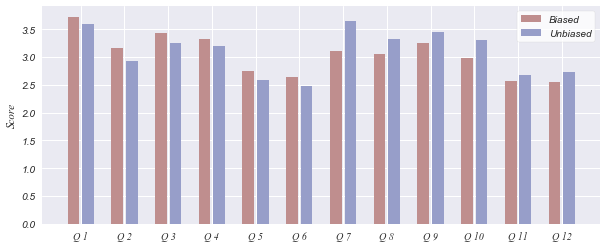

# ARQGAN survey results visualization

These are the results from a survey aimed at evaluating the performance of two Deep Learning models.<br>
The survey was structured in two sections; in the first one, participants were shown single images corresponding to three different reconstruction methods, the first two being AI-based:
- Segmentation aided
- Direct
- Manual

The manual "reconstruction" was carried out by modeling a 3D temple in SketchUp (a 3D program for architecture).<br><br>
In the second section, participants were shown ruin-reconstruction image pairs accompanied by questions akin to the ones in the first part. This section of the survey was aimed at evaluating the perforrmance of our best model at the time (segmentation aided).<br><br>

This survey was aimed at two different groups, one biased and one unbiased; the former was comprised of architecture professors and students who were briefed and knew about the project beforehand; the latter one was comprised of professors and students from other disciplines who knew nothing about the project.

The survey was carried out using Google Forms. The results were exported as a csv file and transformed using pandas. The figures were made using matplotlib.
<br>

### First section

Participants were asked the following questions:
1. "Can you see a building in the image?"
2. "Can you perceive incoherences in the image?"
3. "Can you identify a coherent architectonical language?"
4. "Can you identify a concrete classical language?"
5. "Can you discern the image's details?"
6. "Rate the image's resolution"



<details>
    <summary><b>Code:</b></summary>
    
```python
pregs_plot = [f'pregunta_{x}' for x in range(6)]
opts_plot = ['Colores', 'Directo', 'Reales']

ticks = [x for x in range(40)]
box_start = 1
colors = ['#979ec9',  # segmentation aided
          '#97c999',  # direct
          'white']    # real temples

plt.figure(figsize=(16, 5))
for preg in pregs_plot:
    box = plt.boxplot(list(survey_completa.xs(preg, level='pregunta').values), positions=ticks[box_start:box_start+3], widths=0.6, patch_artist=True)
    
    for i, color in enumerate(colors):
        plt.setp(box['boxes'][i], color=color)
        plt.setp(box['boxes'][i], edgecolor='black')
        plt.setp(box['medians'][i], color='red')
    
    box_start += 5

# fake plots for legend
fake_plots = []
for color in colors:
    fake_plots.append(plt.scatter(1, 1, color=color, edgecolors='black'))
plt.legend(tuple(fake_plots), ('Segmentation aided', 'Direct', 'Real temples'),
           prop=dict(family='Times New Roman', style='italic'), frameon=True, facecolor='white')

for plot in fake_plots:
    plot.set_visible(False)

plt.xticks(ticks=[x for x in range(2, 30, 5)], labels=[f'Q {x}' for x in range(1, 7)],
           family='Times New Roman', style='italic')
plt.ylabel('Score', family='Times New Roman', style='italic')
plt.show()
```
</details>
<br>

### Second section

Participants were asked the following questions:
1. "Seeing the image pair, can you understand the reconstruction?"
2. "Can you perceive any incoherences?"
3. "Can you identify a coherent architectonical language in the reconstruction?"
4. "Can you identify a concrete classical language in the reconstruction?"
5. "Can you discern details in the reconstruction?"
6. "Rate the image's resolution"



<details>
    <summary><b>Code:</b></summary>
    
```python
box = plt.boxplot(list(survey_completa.values), patch_artist=True, widths=0.5)
plt.setp(box['boxes'], color='white')
plt.setp(box['boxes'], edgecolor='black')
plt.setp(box['medians'], color='red')

plt.xticks(ticks=[x for x in range(1, 7)], labels=[f'Q{x}' for x in range(1, 7)], family='Times New Roman', style='italic')
plt.ylabel('Score', family='Times New Roman', style='italic')

plt.show()
```
</details>
<br>

### Biased vs unbiased results



The biased group, on average, rated the first six questions higher than the unbiased one; this tendecy was inverted on the second part of the survey.
<br>The biased group's rating decayed when being exposed to the original ruins accompanied by the AI's reconstruction, while the unbiased group's rating increased; this happened for every question.

<details>
    <summary><b>Code:</b></summary>

```python
colors = ['#bf8e8e',  # biased
          '#979ec9']  # unbiased

ticks = np.arange(1, len(total_preguntas*3), 3)

plt.figure(figsize=(10, 4))
plt.bar(ticks-0.5, list(survey_completa.xs('Sesgado', level='modalidad').values.ravel()), color=colors[0], align='center')
plt.bar(ticks+0.5, list(survey_completa.xs('No sesgado', level='modalidad').values.ravel()), color=colors[1], align='center')

plt.legend(['Biased', 'Unbiased'], frameon=True, facecolor='white')
plt.xticks(ticks=[x for x in range(1, 35, 3)], labels=[f'Q {x}' for x in range(1, len(total_preguntas)+1)], family='Times New Roman', style='italic')
plt.ylabel('Score', family='Times New Roman', style='italic')
```
</details>

<br><br>

### Apendix: source data
<br>

##### Figure 1:

```python
display(survey_completa.head(12))
```


<div>
<table border="1" class="dataframe">
  <thead>
    <tr style="text-align: right;">
      <th></th>
      <th></th>
      <th>user_0</th>
      <th>user_1</th>
      <th>user_2</th>
      <th>user_3</th>
      <th>user_4</th>
      <th>user_5</th>
      <th>user_6</th>
      <th>user_7</th>
      <th>user_8</th>
      <th>user_9</th>
      <th>user_10</th>
      <th>user_11</th>
      <th>user_12</th>
      <th>user_13</th>
      <th>user_14</th>
    </tr>
    <tr>
      <th>pregunta</th>
      <th>modalidad</th>
      <th></th>
      <th></th>
      <th></th>
      <th></th>
      <th></th>
      <th></th>
      <th></th>
      <th></th>
      <th></th>
      <th></th>
      <th></th>
      <th></th>
      <th></th>
      <th></th>
      <th></th>
    </tr>
  </thead>
  <tbody>
    <tr>
      <td rowspan="3" valign="top">pregunta_0</td>
      <td>Colores</td>
      <td>2.2</td>
      <td>3</td>
      <td>4.2</td>
      <td>3.2</td>
      <td>2.2</td>
      <td>4</td>
      <td>3</td>
      <td>4.2</td>
      <td>3.2</td>
      <td>4.2</td>
      <td>5</td>
      <td>4</td>
      <td>3</td>
      <td>4.2</td>
      <td>4.4</td>
    </tr>
    <tr>
      <td>Directo</td>
      <td>3</td>
      <td>3</td>
      <td>4.2</td>
      <td>2.6</td>
      <td>2.2</td>
      <td>4</td>
      <td>3</td>
      <td>3.8</td>
      <td>2.2</td>
      <td>3.4</td>
      <td>5</td>
      <td>3</td>
      <td>2.8</td>
      <td>4</td>
      <td>4.2</td>
    </tr>
    <tr>
      <td>Reales</td>
      <td>2.2</td>
      <td>3</td>
      <td>5</td>
      <td>4</td>
      <td>3</td>
      <td>4</td>
      <td>3</td>
      <td>5</td>
      <td>4.2</td>
      <td>5</td>
      <td>5</td>
      <td>4.8</td>
      <td>3</td>
      <td>4.6</td>
      <td>4.6</td>
    </tr>
    <tr>
      <td rowspan="3" valign="top">pregunta_1</td>
      <td>Colores</td>
      <td>2.6</td>
      <td>1.6</td>
      <td>1.8</td>
      <td>3</td>
      <td>2.4</td>
      <td>2.4</td>
      <td>2</td>
      <td>2.8</td>
      <td>2</td>
      <td>3</td>
      <td>4.8</td>
      <td>3.2</td>
      <td>3</td>
      <td>4</td>
      <td>3.2</td>
    </tr>
    <tr>
      <td>Directo</td>
      <td>1.8</td>
      <td>1.4</td>
      <td>2</td>
      <td>2.4</td>
      <td>2</td>
      <td>2.4</td>
      <td>1.8</td>
      <td>1.8</td>
      <td>1.6</td>
      <td>2.4</td>
      <td>4.8</td>
      <td>2</td>
      <td>2.6</td>
      <td>3.2</td>
      <td>3.2</td>
    </tr>
    <tr>
      <td>Reales</td>
      <td>3.53333</td>
      <td>2.33333</td>
      <td>3.53333</td>
      <td>3.4</td>
      <td>2.8</td>
      <td>2.8</td>
      <td>2.53333</td>
      <td>3.8</td>
      <td>3.33333</td>
      <td>3.33333</td>
      <td>4.73333</td>
      <td>3.46667</td>
      <td>3.73333</td>
      <td>3.46667</td>
      <td>3.73333</td>
    </tr>
    <tr>
      <td rowspan="3" valign="top">pregunta_2</td>
      <td>Colores</td>
      <td>2.4</td>
      <td>3</td>
      <td>1.8</td>
      <td>3.2</td>
      <td>2.6</td>
      <td>2.4</td>
      <td>3</td>
      <td>3.8</td>
      <td>2.8</td>
      <td>2.8</td>
      <td>5</td>
      <td>3.2</td>
      <td>4.2</td>
      <td>4.6</td>
      <td>3.8</td>
    </tr>
    <tr>
      <td>Directo</td>
      <td>1</td>
      <td>2.2</td>
      <td>3</td>
      <td>2.8</td>
      <td>2.4</td>
      <td>2.4</td>
      <td>2.2</td>
      <td>3.2</td>
      <td>2.2</td>
      <td>2.6</td>
      <td>4.8</td>
      <td>2.4</td>
      <td>3.6</td>
      <td>4</td>
      <td>3.8</td>
    </tr>
    <tr>
      <td>Reales</td>
      <td>3.6</td>
      <td>2.33333</td>
      <td>3.73333</td>
      <td>3.26667</td>
      <td>2.86667</td>
      <td>2.86667</td>
      <td>2.73333</td>
      <td>4.13333</td>
      <td>3.13333</td>
      <td>3.26667</td>
      <td>4.93333</td>
      <td>3.8</td>
      <td>4.26667</td>
      <td>4.26667</td>
      <td>4.13333</td>
    </tr>
    <tr>
      <td rowspan="3" valign="top">pregunta_3</td>
      <td>Colores</td>
      <td>2.4</td>
      <td>2.2</td>
      <td>2</td>
      <td>3.2</td>
      <td>2.6</td>
      <td>2.4</td>
      <td>3</td>
      <td>3.4</td>
      <td>3.2</td>
      <td>2.4</td>
      <td>5</td>
      <td>3</td>
      <td>4</td>
      <td>4.2</td>
      <td>4.2</td>
    </tr>
    <tr>
      <td>Directo</td>
      <td>1.8</td>
      <td>2.2</td>
      <td>3.6</td>
      <td>2.8</td>
      <td>2.4</td>
      <td>2.6</td>
      <td>2.8</td>
      <td>3</td>
      <td>2.8</td>
      <td>3</td>
      <td>5</td>
      <td>2.4</td>
      <td>3.6</td>
      <td>4</td>
      <td>3.8</td>
    </tr>
    <tr>
      <td>Reales</td>
      <td>3.4</td>
      <td>1.8</td>
      <td>3.8</td>
      <td>3</td>
      <td>2.86667</td>
      <td>3</td>
      <td>2.6</td>
      <td>3.6</td>
      <td>2.73333</td>
      <td>2.93333</td>
      <td>4.93333</td>
      <td>3.4</td>
      <td>4.13333</td>
      <td>4.2</td>
      <td>4.13333</td>
    </tr>
  </tbody>
</table>
</div>


<br>

##### Figure 2


```python
display(survey_completa.head(10))
```


<div>
<table border="1" class="dataframe">
  <thead>
    <tr style="text-align: right;">
      <th></th>
      <th>user_0</th>
      <th>user_1</th>
      <th>user_2</th>
      <th>user_3</th>
      <th>user_4</th>
      <th>user_5</th>
      <th>user_6</th>
      <th>user_7</th>
      <th>user_8</th>
      <th>user_9</th>
      <th>user_10</th>
      <th>user_11</th>
      <th>user_12</th>
      <th>user_13</th>
      <th>user_14</th>
    </tr>
  </thead>
  <tbody>
    <tr>
      <td>pregunta_0</td>
      <td>2.46667</td>
      <td>3</td>
      <td>4.46667</td>
      <td>3.26667</td>
      <td>2.46667</td>
      <td>4</td>
      <td>3</td>
      <td>4.33333</td>
      <td>3.2</td>
      <td>4.2</td>
      <td>5</td>
      <td>3.93333</td>
      <td>2.93333</td>
      <td>4.26667</td>
      <td>4.4</td>
    </tr>
    <tr>
      <td>pregunta_1</td>
      <td>3</td>
      <td>2</td>
      <td>2.88</td>
      <td>3.12</td>
      <td>2.56</td>
      <td>2.64</td>
      <td>2.28</td>
      <td>3.2</td>
      <td>2.72</td>
      <td>3.08</td>
      <td>4.76</td>
      <td>3.12</td>
      <td>3.36</td>
      <td>3.52</td>
      <td>3.52</td>
    </tr>
    <tr>
      <td>pregunta_2</td>
      <td>2.84</td>
      <td>2.44</td>
      <td>3.2</td>
      <td>3.16</td>
      <td>2.72</td>
      <td>2.68</td>
      <td>2.68</td>
      <td>3.88</td>
      <td>2.88</td>
      <td>3.04</td>
      <td>4.92</td>
      <td>3.4</td>
      <td>4.12</td>
      <td>4.28</td>
      <td>4</td>
    </tr>
    <tr>
      <td>pregunta_3</td>
      <td>2.88</td>
      <td>1.96</td>
      <td>3.4</td>
      <td>3</td>
      <td>2.72</td>
      <td>2.8</td>
      <td>2.72</td>
      <td>3.44</td>
      <td>2.84</td>
      <td>2.84</td>
      <td>4.96</td>
      <td>3.12</td>
      <td>4</td>
      <td>4.16</td>
      <td>4.08</td>
    </tr>
    <tr>
      <td>pregunta_4</td>
      <td>2.44</td>
      <td>1.32</td>
      <td>2.68</td>
      <td>2.8</td>
      <td>2.44</td>
      <td>2</td>
      <td>2.08</td>
      <td>3.08</td>
      <td>1.96</td>
      <td>2.92</td>
      <td>4.68</td>
      <td>2.48</td>
      <td>3.32</td>
      <td>2.68</td>
      <td>3.24</td>
    </tr>
    <tr>
      <td>pregunta_5</td>
      <td>2.44</td>
      <td>1.32</td>
      <td>2.52</td>
      <td>3.12</td>
      <td>2.04</td>
      <td>2.48</td>
      <td>2.04</td>
      <td>2.28</td>
      <td>2.44</td>
      <td>3</td>
      <td>4.44</td>
      <td>2.4</td>
      <td>3.16</td>
      <td>2</td>
      <td>2.76</td>
    </tr>
  </tbody>
</table>
</div>


<br>


##### Figure 3

```python
display(survey_completa.head(10))
```


<div>
<table border="1" class="dataframe">
  <thead>
    <tr style="text-align: right;">
      <th></th>
      <th></th>
      <th>mean</th>
    </tr>
    <tr>
      <th>pregunta</th>
      <th>modalidad</th>
      <th></th>
    </tr>
  </thead>
  <tbody>
    <tr>
      <td rowspan="2" valign="top">pregunta_0</td>
      <td>Sesgado</td>
      <td>3.725</td>
    </tr>
    <tr>
      <td>No sesgado</td>
      <td>3.59048</td>
    </tr>
    <tr>
      <td rowspan="2" valign="top">pregunta_1</td>
      <td>Sesgado</td>
      <td>3.16</td>
    </tr>
    <tr>
      <td>No sesgado</td>
      <td>2.92571</td>
    </tr>
    <tr>
      <td rowspan="2" valign="top">pregunta_2</td>
      <td>Sesgado</td>
      <td>3.43</td>
    </tr>
    <tr>
      <td>No sesgado</td>
      <td>3.25714</td>
    </tr>
    <tr>
      <td rowspan="2" valign="top">pregunta_3</td>
      <td>Sesgado</td>
      <td>3.32</td>
    </tr>
    <tr>
      <td>No sesgado</td>
      <td>3.19429</td>
    </tr>
    <tr>
      <td rowspan="2" valign="top">pregunta_4</td>
      <td>Sesgado</td>
      <td>2.755</td>
    </tr>
    <tr>
      <td>No sesgado</td>
      <td>2.58286</td>
    </tr>
  </tbody>
</table>
</div>

